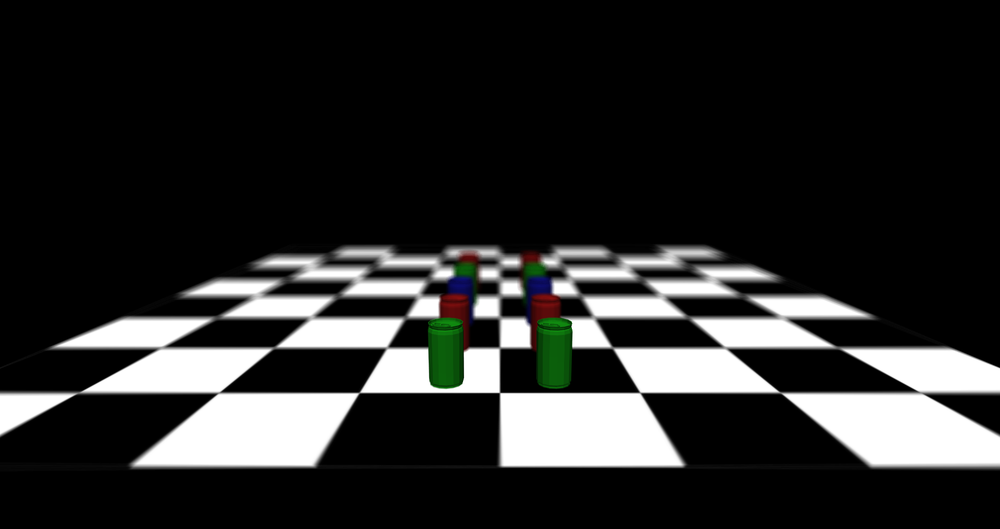
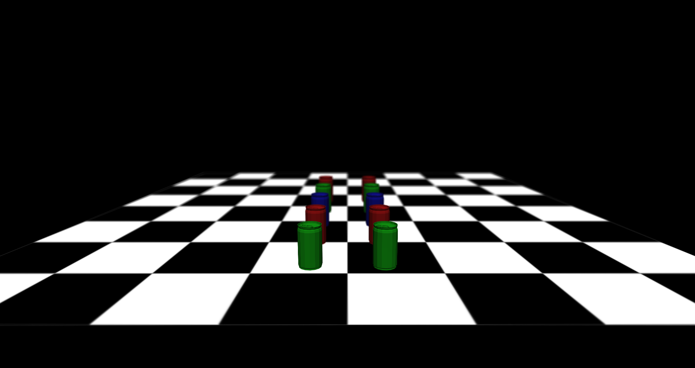

## Introduction
The aim of this project is to create a realistic camera model in OpenGL where the camera can be defined with typical photography parameters (eg f-stop)

## Compile instructions
### Requirements
The following tools must be installed:
- cmake (version 3.13 or above)
- compiler with c++20 support (e.g gcc 9.2)

The following libraries must be installed:
- glfw3
- glm
- GLEW
- libPNG

In addition, a version of OpenGL 4.2 or above is needed

### Compile
The following commands must be executed in order to compile the renderer using cmake

```bash
$ mkdir build
$ cd build
$ cmake ..
$ make
```

## Usage instructions
Once it is compiled, the renderer can be executed using the following command from the project root:

```
$ build/TestingOpenGL <scenePath>
```

Where scenePath is the path of a scene (e.g assets/scene/scene_cans_with_plane.json).

The scheme of the scene descriptions files can be found in [input/scene_schema.json](input/scene_schema.json).

While the program is running, you can switch between pinhole mode and realistic camera mode with the R key. Also, you can take a picture of the screen with the S key.

## Examples
The following images have been generated using the renderer and the scene assets/scene/scene1_with_plane.json.

Command to execute it:

```
$ build/TestingOpenGL assets/scene/scene_cans_with_plane.json
```

Renders obtained:

Pinhole mode | Realistic camera f-stop 1.0 |  Realistic camera f-stop 2.0
:-------------------------:|:-------------------------:|:-------------------------:
 |   | 

Realistic camera f-stop 4.0 | Realistic camera f-stop 8.0 |  Realistic camera f-stop 16.0
:-------------------------:|:-------------------------:|:-------------------------:
 |   | 